# Berger LMS - Workflow Connections Documentation

This document describes the orchestration flow and integration touchpoints between the frontend UI, n8n webhook nodes, and the database operations in the Berger Lead Management System (LMS).

---

## 1. Overview Architecture

Below is a visual representation of how the components interact:

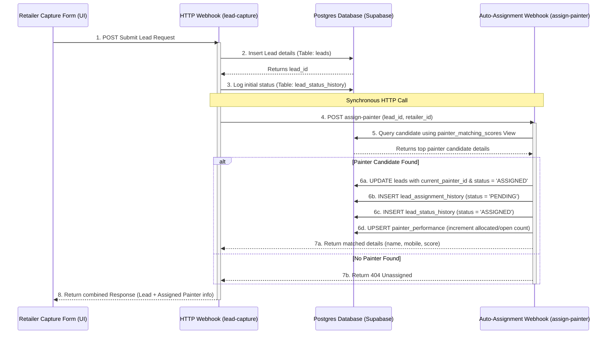

---

## 2. Integration Touchpoints

### A. Retailer Lead Form &rarr; Lead Capture Webhook
- **Trigger:** Frontend form submit event.
- **Data Payload:** Customer details, site specifications (carpet area range), scheduled visit timestamps.
- **Connection Protocol:** Asynchronous HTTP POST request via Fetch API.

### B. Lead Capture Webhook &rarr; Painter Assignment Webhook
- **Trigger:** Insertion of lead details and initialization of `CREATED` status.
- **Data Payload:** `lead_id` (newly generated UUID) and `retailer_id`.
- **Connection Protocol:** Synchronous HTTP POST request executed inside n8n via the upgraded HTTP Request Node (`typeVersion: 4.1`).

### C. Painter Assignment Webhook &rarr; Database View
- **Trigger:** Execution of the assignment matching search query.
- **Data Query:** Queries `painter_matching_scores` joining `retailer_painter_mapping` and `painter_performance` on-the-fly.
- **Connection Protocol:** SQL Select query returning a single record.

### D. Final Webhook Response &rarr; Frontend UI
- **Trigger:** Resolution of the painter assignment request.
- **Data Payload:** Combined response containing success message and matched painter details (ID, Name, Mobile, matching Score).
- **Connection Protocol:** Webhook response JSON output.

---

## 3. Painter Response & Reassignment Sequence

This flow manages the painter interaction when they click Accept or Decline from their mobile link:

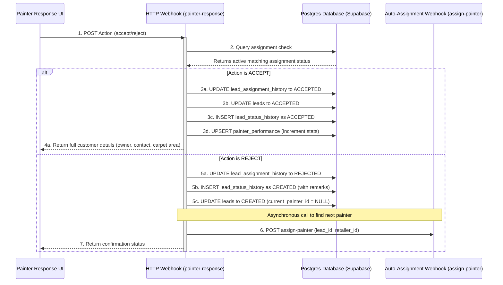

- **GET `/painter-lead-details`**: Fetch basic site details on landing.
- **POST `/painter-response`**: Updates painter response state and logs status changes.
- **Outbound HTTP request to `/assign-painter`**: Triggers immediate reassignment on painter rejection, keeping the pipeline automated.

---

## 4. Open Leads Dashboard Loading Sequence

This flow manages loading user details and open leads depending on the user type logged in:

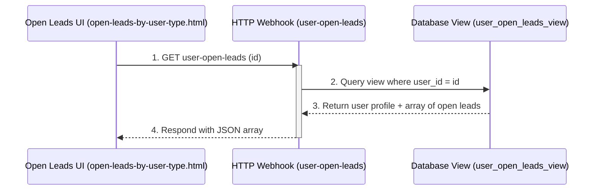

- **GET `/user-open-leads?userid=...`**: Unified endpoint checking the view and serving Retailers, Painters, and Customers.

---

## 5. Lead Progress Timeline Loading Sequence

This flow manages loading detailed status histories and assignment logs upon clicking a lead card:

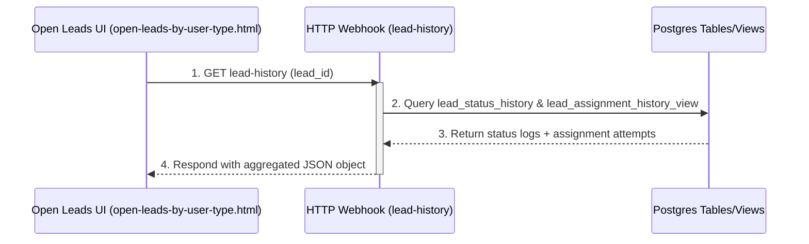

### Integration Touchpoints
- **GET `/lead-history?lead_id=...`**: Fetch combined timeline entries (status logs + partner reassignments).

---

## 6. Painter Check-in & Geofencing Sequence

This flow manages the painter geolocation acquisition, geofencing checks, and check-in updates:

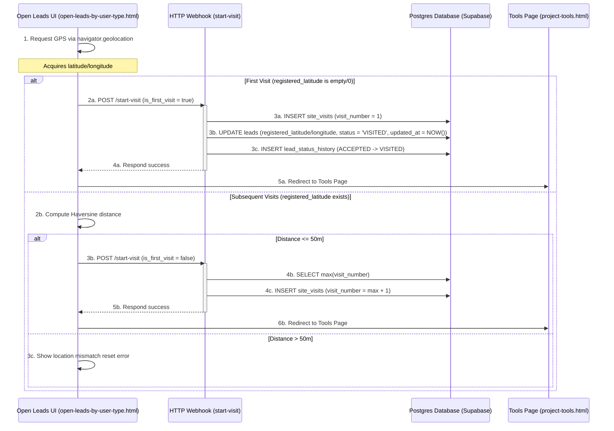

- **POST `/start-visit`**: Records check-in logs and updates lead status to `VISITED` for first visits.
- **Redirection**: On successful check-in, redirects the user to `project-tools.html` with query parameters.

---

## 7. Schedule Follow-up Sequence

This flow manages passing lead detail parameters to the follow-up form and saving follow-up records:

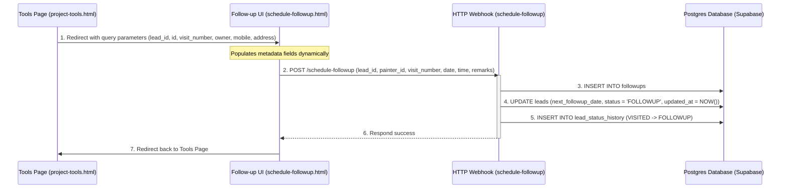

- **GET Parameters**: No database query is made on page load. All metadata values are read directly from URL query parameters.
- **POST `/schedule-followup`**: Updates the lead schedule and inserts followup rows.

---

## 8. Submit Estimate Sequence

This flow manages product catalog loading, version resolution, estimate insertion, and history aggregation:

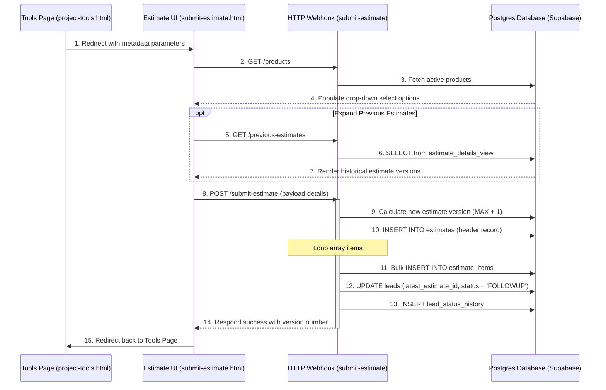

- **GET `/products`**: Populates the product search items.
- **GET `/previous-estimates`**: Connects via `estimate_details_view` to read historic version cards.
- **POST `/submit-estimate`**: Batch logs calculations and updates lead status.

---

## 9. Partner Portal Login Sequence

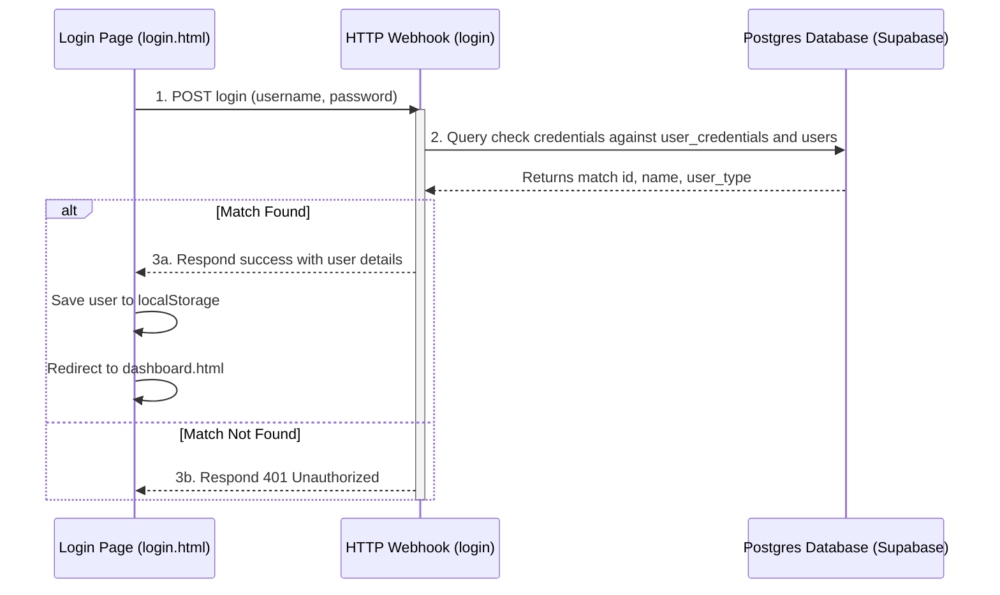

---

## 10. Partner Portal Summary & Drilldown Sequence

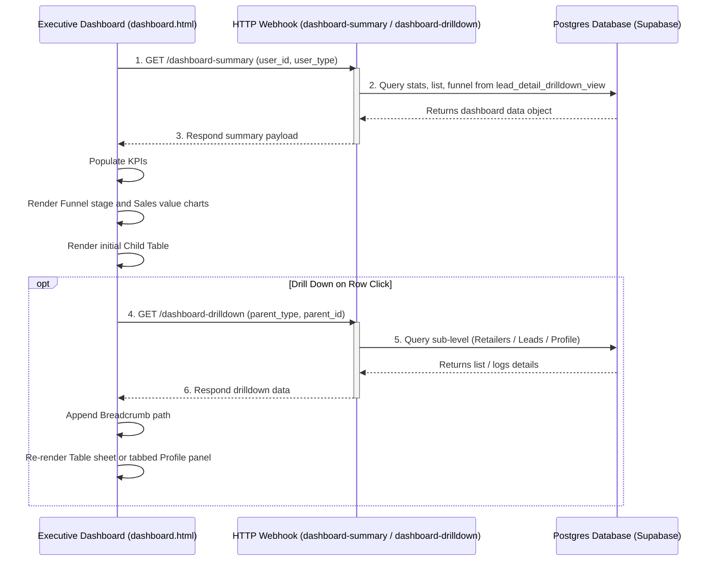

---

## 11. Secure Product Knowledge Base Sequence

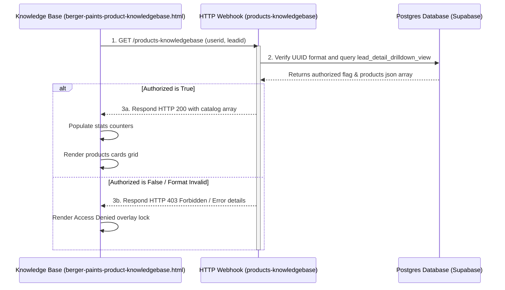

---

## 12. Estimate Details & PDF Generation Sequence

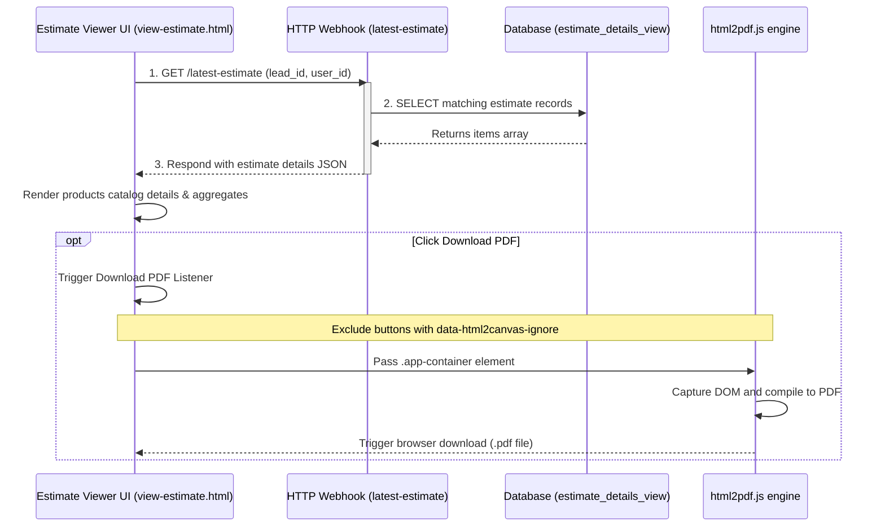

---

## 13. WhatsApp Parallel Tool Agent Loop & Memory Sequence

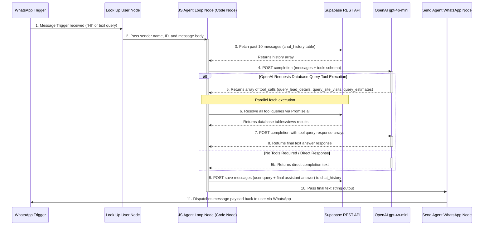

---

## 14. Painter Consultation Calendar Load Flow

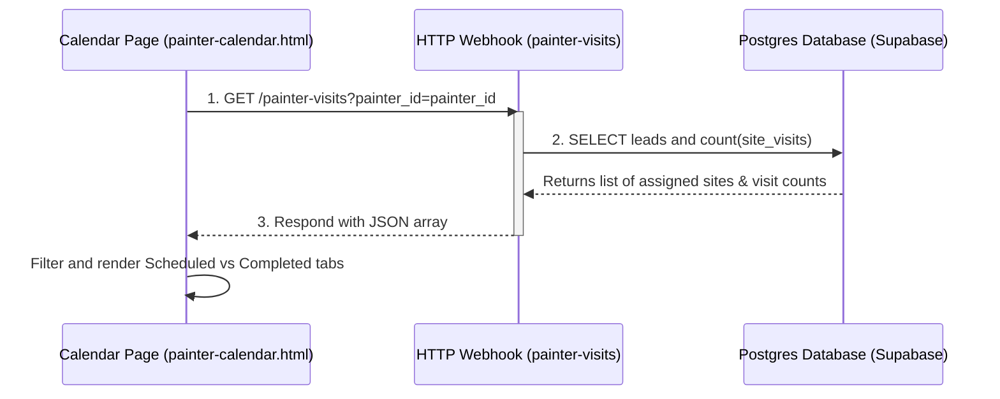

---

## 15. Painter Assignment Timeout Reassignment Sequence

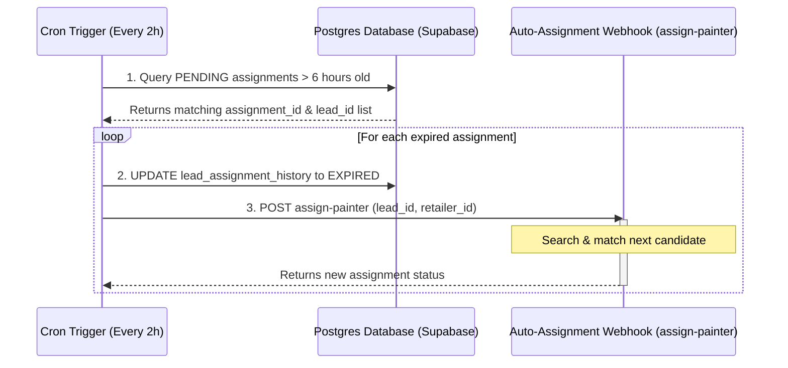

---

## 16. Daily Site Visit Reminders Notification Sequence

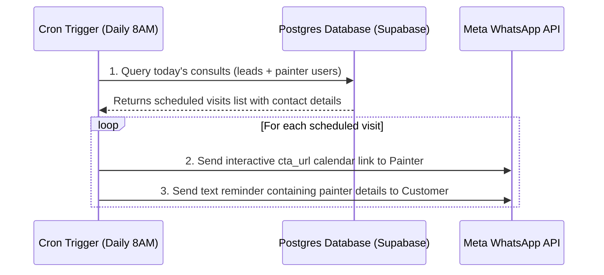

