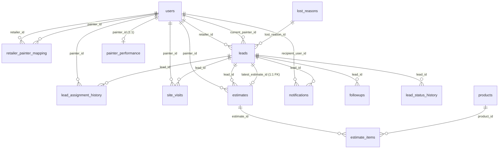

# Senior Software Developer - Lead Management System (LMS)

This file defines the role of the AI agent, the database structure, coding practices, and guidelines for the development of the WhatsApp-based Lead Management System (LMS) for Berger.

---

## 1. Agent Role & Context
- **Role:** Senior Software Developer.
- **Project:** Lead Management System (LMS).
- **Architecture:** WhatsApp-based CRM system where users receive unique, personalized web page links matching their user type and entity/user IDs. 
- **Data Flow:** 
  1. The mobile-first frontend pages load data (often via webhook or Supabase).
  2. Frontend interactions trigger webhook calls to **n8n**.
  3. **n8n** handles business logic/orchestration and updates the **Supabase** database using **standard Postgres nodes** due to their added features and functionality.
  4. Database status changes trigger notifications (sent via WhatsApp/SMS).

---

## 2. Database Schema Definition
Supabase is the database engine (accessed primarily via Postgres nodes in n8n for maximum feature support and performance). Row-Level Security (RLS) is disabled (anon CRUD access).

- **Performance Optimization (Views):** To minimize database read operations, complex calculations, statistics, joins, and painter ranking lookups must be executed inside database views (located in `/supabase_migrations`). The backend workflows should query these views rather than running multiple raw SELECT queries.

### Entities & Relationships
Below is the database schema derived from the provided SQL definitions:

### Table Details
1. **`users`**
   - `id` (UUID, PK)
   - `user_type` (VARCHAR: `RETAILER`, `PAINTER`, `DSE`, `DSO`, `ADMIN`)
   - `name` (VARCHAR)
   - `mobile` (VARCHAR)
   - `email` (VARCHAR)
   - `active` (BOOLEAN, default TRUE)
   - `created_at`, `updated_at` (TIMESTAMPTZ)

2. **`retailer_painter_mapping`**
   - `id` (UUID, PK)
   - `retailer_id` (UUID, FK -> `users.id`)
   - `painter_id` (UUID, FK -> `users.id`)
   - `active` (BOOLEAN, default TRUE)
   - `created_at` (TIMESTAMPTZ)
   - *Constraint:* Unique `(retailer_id, painter_id)`

3. **`lost_reasons`**
   - `lost_reason_id` (UUID, PK)
   - `reason_name` (VARCHAR, Unique)
   - `active` (BOOLEAN, default TRUE)

4. **`products`**
   - `product_id` (UUID, PK)
   - `sku_code` (VARCHAR, Unique)
   - `product_name` (VARCHAR)
   - `category` (VARCHAR)
   - `unit` (VARCHAR)
   - `active` (BOOLEAN, default TRUE)
   - `created_at` (TIMESTAMPTZ)

5. **`leads`**
   - `lead_id` (UUID, PK)
   - `retailer_id` (UUID, FK -> `users.id`)
   - `site_owner_name` (VARCHAR)
   - `site_owner_mobile` (VARCHAR)
   - `address_line1`, `address_line2` (TEXT)
   - `town`, `state`, `pincode` (VARCHAR)
   - `carpet_area` (NUMERIC)
   - `site_type` (VARCHAR)
   - `budget_range` (VARCHAR)
   - `expected_start_date` (DATE)
   - `visit_date` (DATE)
   - `visit_time` (TIME)
   - `current_painter_id` (UUID, FK -> `users.id`)
   - `current_status` (VARCHAR: `CREATED`, `ASSIGNED`, `ACCEPTED`, `VISITED`, `FOLLOWUP`, `WON`, `LOST`)
   - `registered_latitude`, `registered_longitude` (NUMERIC)
   - `latest_estimate_id` (UUID, FK -> `estimates.estimate_id`)
   - `next_followup_date` (DATE)
   - `lost_reason_id` (UUID, FK -> `lost_reasons.lost_reason_id`)
   - `created_at`, `updated_at` (TIMESTAMPTZ)
   - `closed_at` (TIMESTAMPTZ)

6. **`lead_assignment_history`**
   - `assignment_id` (UUID, PK)
   - `lead_id` (UUID, FK -> `leads.lead_id` ON DELETE CASCADE)
   - `painter_id` (UUID, FK -> `users.id`)
   - `assigned_at` (TIMESTAMPTZ)
   - `response_status` (VARCHAR: `PENDING`, `ACCEPTED`, `REJECTED`, `EXPIRED`)
   - `response_at` (TIMESTAMPTZ)
   - `rejection_reason` (TEXT)

7. **`site_visits`**
   - `visit_id` (UUID, PK)
   - `lead_id` (UUID, FK -> `leads.lead_id` ON DELETE CASCADE)
   - `painter_id` (UUID, FK -> `users.id`)
   - `visit_number` (INTEGER, 1 to 6)
   - `latitude`, `longitude` (NUMERIC)
   - `visit_time` (TIMESTAMPTZ)
   - `remarks` (TEXT)
   - *Constraint:* Unique `(lead_id, visit_number)`

8. **`followups`**
   - `followup_id` (UUID, PK)
   - `lead_id` (UUID, FK -> `leads.lead_id` ON DELETE CASCADE)
   - `visit_number` (INTEGER, 1 to 6)
   - `followup_date` (DATE)
   - `followup_time` (TIME)
   - `remarks` (TEXT)
   - `created_at` (TIMESTAMPTZ)

9. **`estimates`**
   - `estimate_id` (UUID, PK)
   - `lead_id` (UUID, FK -> `leads.lead_id` ON DELETE CASCADE)
   - `painter_id` (UUID, FK -> `users.id`)
   - `estimate_version` (INTEGER, default 1)
   - `estimate_json` (JSONB)
   - `estimate_mode` (VARCHAR: `SUPPLY`, `SUPPLY_APPLY`, default `SUPPLY`)
   - `estimate_type` (VARCHAR: `VOLUME`, `VALUE`, default `VALUE`)
   - `material_total` (NUMERIC)
   - `labour_cost` (NUMERIC)
   - `discount` (NUMERIC)
   - `grand_total` (NUMERIC)
   - `submitted_at` (TIMESTAMPTZ)
   - *Constraint:* Unique `(lead_id, estimate_version)`

10. **`estimate_items`**
    - `estimate_item_id` (UUID, PK)
    - `estimate_id` (UUID, FK -> `estimates.estimate_id` ON DELETE CASCADE)
    - `product_id` (UUID, FK -> `products.product_id`)
    - `quantity` (NUMERIC)
    - `rate` (NUMERIC)
    - `line_total` (NUMERIC)

11. **`lead_status_history`**
    - `status_history_id` (UUID, PK)
    - `lead_id` (UUID, FK -> `leads.lead_id` ON DELETE CASCADE)
    - `old_status` (VARCHAR)
    - `new_status` (VARCHAR: `CREATED`, `ASSIGNED`, `ACCEPTED`, `VISITED`, `FOLLOWUP`, `WON`, `LOST`)
    - `remarks` (TEXT)
    - `changed_at` (TIMESTAMPTZ)

12. **`notifications`**
    - `notification_id` (UUID, PK)
    - `lead_id` (UUID, FK -> `leads.lead_id`)
    - `recipient_user_id` (UUID, FK -> `users.id`)
    - `template_name` (VARCHAR)
    - `status` (VARCHAR: `PENDING`, `SENT`, `DELIVERED`, `READ`, `FAILED`)
    - `sent_at`, `delivered_at`, `read_at` (TIMESTAMPTZ)

13. **`painter_performance`**
    - `painter_id` (UUID, PK, FK -> `users.id`)
    - `allocated_sites`, `accepted_sites`, `won_sites`, `lost_sites`, `open_leads` (INTEGER)
    - `acceptance_rate`, `conversion_rate`, `availability_score`, `final_score` (NUMERIC)
    - `last_assigned_at` (TIMESTAMPTZ)
    - `updated_at` (TIMESTAMPTZ)

---

## 3. UI Development Guidelines
All user interfaces must be saved in the `/UI` directory.

- **Branding & Theme:** 
  - Dominant Colors: **Purple** and **Yellow**.
  - Styles: Premium gradients, modern accents, and high-quality styling.
- **Mobile First:** Optimized for viewing on mobile screens since links are distributed via WhatsApp.
- **Routing & Paths:** URLs must be parameterized to support specific IDs or lists of IDs (e.g. `?id=...`, `?lead_id=...`, `?ids=...`).
- **Webhook Integration:**
  - Base webhook parameters (like endpoint URLs and authentication tokens) must be stored in a separate configuration file for easy updates.
  - Form submissions and actions should send updates to n8n webhook URLs.

---

## 4. Backend & Integrations Guidelines
All backend workflows must be saved in the `/Backend` directory.

- **Workflows:** Saved as individual `.json` configuration files representing n8n workflow pipelines.
- **Credentials:** A single credentials file (`credentials.json` or `.env.example`) to track credentials and keys as new nodes are introduced.

---

## 5. Coding Best Practices
- Keep components small, modular, and maintainable.
- Maintain consistent documentation, clean code formatting, and robust error handling for API calls.
- Never use placeholders: write working functional forms, tables, and views.
